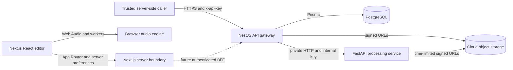

# AudioMass architecture

## System boundary

AudioMass is a browser-first audio editor. Interactive playback, metering, waveform work, and low-latency DSP stay on the user's device. Durable project state, storage grants, and long-running processing are server responsibilities.

The browser never calls the Python service. The current editor also does not embed the service-level API key or call cloud routes directly. A future browser integration must derive identity in a trusted Next.js backend-for-frontend or another authenticated server; `ownerId` is a resource scope, not proof of identity. The API gateway owns service authentication, job state, object metadata, storage grants, request validation, idempotency, and public API versioning. FastAPI accepts only the internal service key and processes either a bounded multipart upload or a presigned storage job.

## Workspace layout

| Path                    | Responsibility                                                                        |
| ----------------------- | ------------------------------------------------------------------------------------- |
| `apps/web`              | Next.js 16 App Router, React editor features, preferences, redirects, and PWA shell   |
| `apps/api`              | NestJS 11 public API and Python-processing orchestrator                               |
| `apps/python-api`       | FastAPI DSP, analysis, export, transcription, and trusted server plugins              |
| `packages/audio-engine` | Typed Web Audio, AudioWorklet, worker, peak, PCM, and shared-buffer primitives        |
| `packages/plugin-sdk`   | Browser plugin manifest validation, lifecycle, RPC, contributions, and scoped storage |
| `packages/database`     | Prisma schema, generated client, PostgreSQL adapter, and migrations                   |
| `packages/config`       | Shared TypeScript and ESLint configuration                                            |
| `tooling`               | Safe workspace maintenance scripts                                                    |

Turborepo schedules package-local build, lint, typecheck, test, and clean tasks. pnpm owns one lockfile and links internal packages through the workspace protocol.

## Browser application

The target editor is a normal App Router feature, not a document embedded in an
iframe. Server components read validated locale/theme preferences; client
components render controls and translate interaction into typed commands. A
React provider owns one `EditorController`, `useSyncExternalStore` publishes
immutable snapshots, hooks own keyboard/drop lifecycles, and feature components
own transport, timeline, markers, dialogs, notifications, effects, menus,
analyzers, and tracks.

`packages/audio-engine` is the framework-independent boundary. It contains the
Web Audio graph, PCM edits, WAV encoding, typed WAV/tempo/frequency worker
clients, recording/worklet protocols, loudness, tempo, FFT, and STFT analysis,
ID3/MP4 metadata, bounded history, markers, versioned project parsing,
multitrack entities, and scheduling. Its multitrack application boundary owns
copied PCM sources,
mute/solo and channel/master gain rules, transport snapshots, a disposable Web
Audio playback/mixer graph, equal-power crossfade pairs, and deterministic
stereo PCM bounce. Browser infrastructure decodes files and persists complete
project/source/mixer/crossfade documents in IndexedDB. No package module reads
React context, cookies, or Next.js APIs.

Waveform presentation follows the same boundary. `EditorSession` exposes a
monotonic audio revision that changes only with rendered PCM; playback position
and document-only updates do not invalidate peaks. A lazy, request-correlated
worker returns combined overview plus per-channel peak arrays from owned PCM
copies. React owns responsive ruler/viewport math, zoom, scroll, selection,
markers, and semantic controls, while Canvas only paints peak pixels. The native
multitrack surface renders the immutable project snapshot as ruler, track, clip,
fade, crossfade, and playhead layers without reading Web Audio nodes or runtime
globals.

Frequency presentation follows that ownership model. The audio package validates
bounded FFT/STFT options and returns typed spectrum and frame-major spectrogram
arrays from a request-correlated worker. `EditorController` creates that worker
port lazily from rendered PCM, while React rejects stale audio-revision/config
results and owns controls plus accessible numerical summaries. Canvas paints the
frequency line or spectrogram pixels only. A typed panel registry and React
File/Edit/View menu compose waveform, frequency, spectral, and mixer workspaces;
they dispatch typed commands and never navigate to classic tool pages.

Single-track editing is an application transaction, not a React state mutation.
The session history stores immutable document/PCM states; copy, cut, paste,
delete, trim, and silence insertion transform audio, selection, and marker time
together. Undo/redo reloads the restored PCM into the playback graph. WAV export
uses an encoder port in the audio package and a browser-download adapter in the
Next.js infrastructure layer, so neither the controller nor components create
workers, blobs, or anchors directly.

Primary effect dialogs consume discriminated schemas from the audio package.
Each parameter declares its kind, default, range/options, step, and unit; built-in
presets contain typed values validated against the same contract. Custom presets
use a versioned document codec. Only the browser repository reads `Storage` and
performs the conservative migration from unambiguous legacy positional values;
React, DSP, and domain modules never parse comma-delimited preset strings.

The old codec, compression, noise-suppression, and WaveSurfer bundles were
reachable only through the compatibility gateway and were removed in Wave F.
Their historical attributions remain in `THIRD_PARTY_NOTICES.md`; the current
application loads no vendor globals or ordered classic scripts.

`/editor` is the framework-native production composition. Its Server Component
reads validated preferences and panel query state before rendering the React
shell; `/editor/native` is only a validated redirect to that canonical route.
Wave F removed `/editor-runtime`, its old IIFEs/globals, manifest, iframe bridge,
generated runtime build, fallback tool hosts, vendor gateway, and patch CSS.
Web development, tests, and builds now compile only the native application and
its `@audiomass/audio-engine` prerequisite.

The native multitrack transport, mixer, frequency analyser, and spectral analyser
now live directly inside the editor feature and never access a runtime global.
The three `/tools/*` URLs are Server Component redirects to typed editor panels;
they contain no client host, mixer global access, or query bridge. Locale and
theme changes use validated cookie preferences read by Server Components and
passed as serializable data to the client shell. App Router owns the manifest,
and a native hook registers the service worker and caches observed same-origin
Next.js resources for offline reloads.

The About surface and offline cache are also owned by Next.js and a root service
worker rather than standalone HTML/AppCache entrypoints.

Cross-origin isolation headers are emitted by Next.js so supported browsers can use `SharedArrayBuffer`. The engine provides a typed event surface, worklet registration, worker-backed peak extraction, PCM helpers, and a lock-free ring buffer. The UI must feature-detect browser capabilities and retain a non-shared-memory path.

## Plugin boundaries

Browser plugins declare a versioned manifest and explicit capabilities. The host validates manifests, prevents duplicate registrations, scopes plugin storage, tracks disposable resources, and uses request-correlated RPC messages with timeouts. Contributions are registered through typed registries rather than by mutating application globals.

Python plugins are different: they are trusted, server-installed functions in an allowlisted registry. The API never imports code supplied in a request and never evaluates arbitrary Python.

## Public API and persistence

All public business routes are under `/api/v1` and require a server-held `x-api-key`; liveness and readiness probes are public. Never expose that key through `NEXT_PUBLIC_*` or legacy browser code. Project and file routes additionally scope lookups by `ownerId`, but a trusted caller must derive that value from its authenticated session. Validation strips no unknown data silently: unknown DTO fields are rejected. Fastify provides the NestJS HTTP adapter, with Helmet, a validated exact-origin CORS allowlist, request body limits, and rate limiting configured during bootstrap.

PostgreSQL stores projects, processing jobs, and storage-object lifecycle state. Project updates use a version field for optimistic concurrency. Processing creation can use an idempotency key, and status transitions are validated. Object keys are generated by the server and remain opaque to clients.

## File and processing flow

1. The client asks NestJS for an upload grant.
2. NestJS creates a `PENDING` storage record and returns a short-lived provider-specific upload URL.
3. The client uploads directly to object storage, then calls the completion endpoint.
4. NestJS verifies remote metadata before marking the object `READY`.
5. For heavy work, NestJS creates a processing job and a pending output object.
6. NestJS sends FastAPI short-lived input and output URLs plus a constrained operation name.
7. FastAPI streams the input to a bounded temporary file, executes the operation, and streams the result to storage.
8. NestJS verifies the output, records its actual size, and commits the terminal job state.

S3-compatible storage, MinIO, Supabase Storage, and Vercel Blob implement the same service interface. Storage credentials never reach the browser or Python service.

## Failure model

- Request IDs cross the NestJS/FastAPI boundary and are included in structured Python logs.
- FastAPI applies upload limits, concurrency limits, remote timeouts, temp-file cleanup, HTTPS enforcement, and an exact storage-host allowlist.
- A failed remote operation marks its processing job failed and rejects the reserved output object.
- Deleting a database record is not used as a substitute for deleting cloud data; storage deletion and lifecycle state are coordinated.
- Readiness checks include PostgreSQL connectivity, while liveness only reports that the process can serve requests.

## Scaling model

The web and API images are stateless and can scale horizontally. FastAPI is also stateless, but each replica enforces a local concurrency ceiling; production schedulers should combine that limit with CPU, memory, and GPU resource limits. PostgreSQL and object storage are external durable services. Long-running work is represented in the database so execution can later move to a queue without changing the browser contract.

## Final migration boundary

Waves A–G are closed. Executable editor code has one framework-native path:
Next.js App Router and React presentation under `apps/web`, with browser audio
domain/application behavior in `packages/audio-engine`. The only tracked
first-party JavaScript file in the Web application is the root service worker,
`apps/web/public/sw.js`; it is a browser entrypoint, not a classic editor module.
There is no `apps/web/editor-runtime`, generated `/editor-assets`, iframe bridge,
ordered-script manifest, runtime global, or standalone tool page.

Repository documentation is part of this boundary. `pnpm docs:check` requires
the canonical document set and validates relative Markdown links; CI runs it
alongside format, lint, typecheck, tests, builds, and dependency audits. The
per-wave evidence and the post-deletion inventory are recorded in
[FRAMEWORK_NATIVE_EDITOR_PLAN.md](FRAMEWORK_NATIVE_EDITOR_PLAN.md).
