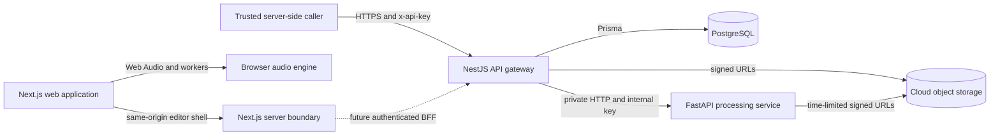

# AudioMass architecture

## System boundary

AudioMass is a browser-first audio editor. Interactive playback, metering, waveform work, and low-latency DSP stay on the user's device. Durable project state, storage grants, and long-running processing are server responsibilities.

The browser never calls the Python service. The current editor also does not embed the service-level API key or call cloud routes directly. A future browser integration must derive identity in a trusted Next.js backend-for-frontend or another authenticated server; `ownerId` is a resource scope, not proof of identity. The API gateway owns service authentication, job state, object metadata, storage grants, request validation, idempotency, and public API versioning. FastAPI accepts only the internal service key and processes either a bounded multipart upload or a presigned storage job.

## Workspace layout

| Path                    | Responsibility                                                                        |
| ----------------------- | ------------------------------------------------------------------------------------- |
| `apps/web`              | Next.js 16 App Router shell and the isolated same-origin editor runtime               |
| `apps/api`              | NestJS 11 public API and Python-processing orchestrator                               |
| `apps/python-api`       | FastAPI DSP, analysis, export, transcription, and trusted server plugins              |
| `packages/audio-engine` | Typed Web Audio, AudioWorklet, worker, peak, PCM, and shared-buffer primitives        |
| `packages/plugin-sdk`   | Browser plugin manifest validation, lifecycle, RPC, contributions, and scoped storage |
| `packages/database`     | Prisma schema, generated client, PostgreSQL adapter, and migrations                   |
| `packages/config`       | Shared TypeScript and ESLint configuration                                            |
| `tooling`               | Safe workspace maintenance scripts                                                    |

Turborepo schedules package-local build, lint, typecheck, test, and clean tasks. pnpm owns one lockfile and links internal packages through the workspace protocol.

## Browser application

The App Router shell supplies metadata, security headers, theme bootstrap, route-level loading and error boundaries, and an accessible application frame. The editor document is generated by the `/editor-runtime` Route Handler from a typed, tested asset manifest and is loaded from the same origin in an iframe. `apps/web/editor-runtime` is the sole source boundary: typed preference, localization, theme, bridge, mutable `AudioBuffer`, and shared Web Audio/DSP services live at its root, while behavior-preserving UI/DSP scripts, styles, codecs, workers, and media live under `editor-runtime/static`. A deterministic compile-and-copy step emits the complete ignored `public/editor-assets` tree before development, tests, and production builds. `actions.js` delegates copy, trim, insert, silence, replacement, gain, normalization, fade-curve, and playback-rate primitives to typed services while retaining the internal names consumed by the established effect bank. The public runtime contains no static HTML entrypoint or retired asset namespace.

The frequency analyser, spectral analyser, and multitrack mixer have already crossed that boundary. They live under `/tools/*` as shared React/Canvas routes and retain the editor's dock, popup, frequency-stream, and mixer-control contracts through a narrow same-origin host adapter. Locale and theme changes use the versioned editor bridge. Preference application suppresses intermediate bridge events, and the Next.js shell serializes validated cookie writes so an older request cannot restore a stale language. The About surface and offline cache are also owned by Next.js and a root service worker rather than standalone HTML/AppCache entrypoints.

Cross-origin isolation headers are emitted by Next.js so supported browsers can use `SharedArrayBuffer`. The engine provides a typed event surface, worklet registration, worker-backed peak extraction, PCM helpers, and a lock-free ring buffer. The UI must feature-detect browser capabilities and retain a non-shared-memory path.

## Plugin boundaries

Browser plugins declare a versioned manifest and explicit capabilities. The host validates manifests, prevents duplicate registrations, scopes plugin storage, tracks disposable resources, and uses request-correlated RPC messages with timeouts. Contributions are registered through typed registries rather than by mutating application globals.

Python plugins are different: they are trusted, server-installed functions in an allowlisted registry. The API never imports code supplied in a request and never evaluates arbitrary Python.

## Public API and persistence

All public business routes are under `/api/v1` and require a server-held `x-api-key`; liveness and readiness probes are public. Never expose that key through `NEXT_PUBLIC_*` or legacy browser code. Project and file routes additionally scope lookups by `ownerId`, but a trusted caller must derive that value from its authenticated session. Validation strips no unknown data silently: unknown DTO fields are rejected. Fastify provides the NestJS HTTP adapter, with Helmet, a validated exact-origin CORS allowlist, request body limits, and rate limiting configured during bootstrap.

PostgreSQL stores projects, processing jobs, and storage-object lifecycle state. Project updates use a version field for optimistic concurrency. Processing creation can use an idempotency key, and status transitions are validated. Object keys are generated by the server and remain opaque to clients.

## File and processing flow

1. The client asks NestJS for an upload grant.
2. NestJS creates a `PENDING` storage record and returns a short-lived provider-specific upload URL.
3. The client uploads directly to object storage, then calls the completion endpoint.
4. NestJS verifies remote metadata before marking the object `READY`.
5. For heavy work, NestJS creates a processing job and a pending output object.
6. NestJS sends FastAPI short-lived input and output URLs plus a constrained operation name.
7. FastAPI streams the input to a bounded temporary file, executes the operation, and streams the result to storage.
8. NestJS verifies the output, records its actual size, and commits the terminal job state.

S3-compatible storage, MinIO, Supabase Storage, and Vercel Blob implement the same service interface. Storage credentials never reach the browser or Python service.

## Failure model

- Request IDs cross the NestJS/FastAPI boundary and are included in structured Python logs.
- FastAPI applies upload limits, concurrency limits, remote timeouts, temp-file cleanup, HTTPS enforcement, and an exact storage-host allowlist.
- A failed remote operation marks its processing job failed and rejects the reserved output object.
- Deleting a database record is not used as a substitute for deleting cloud data; storage deletion and lifecycle state are coordinated.
- Readiness checks include PostgreSQL connectivity, while liveness only reports that the process can serve requests.

## Scaling model

The web and API images are stateless and can scale horizontally. FastAPI is also stateless, but each replica enforces a local concurrency ceiling; production schedulers should combine that limit with CPU, memory, and GPU resource limits. PostgreSQL and object storage are external durable services. Long-running work is represented in the database so execution can later move to a queue without changing the browser contract.
